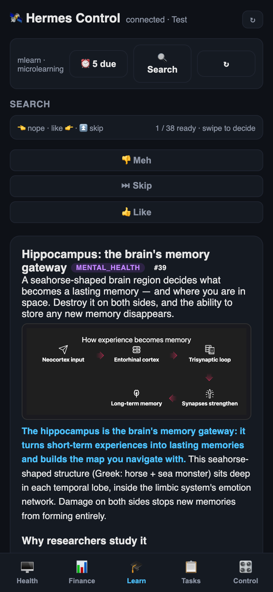
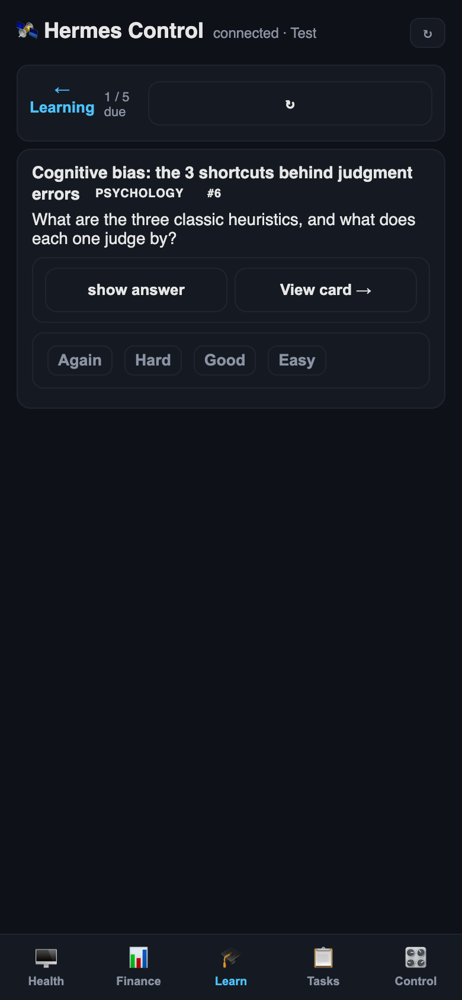
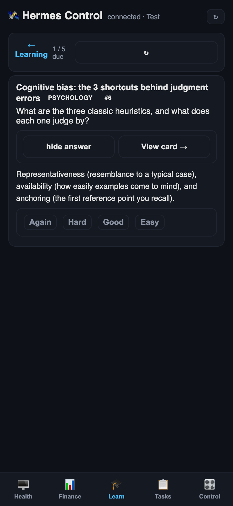
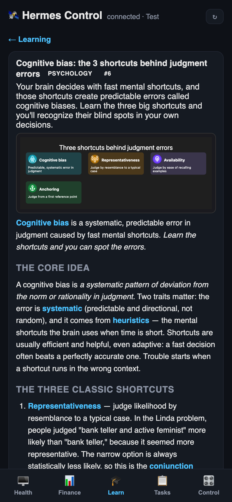

# mlearn

A headless microlearning engine. Discovers content from a curated source
allowlist, generates visual 5-minute cards with recall prompts, schedules them
for retention (spaced repetition), and learns what to serve next from grade
feedback.

## Principles

- **SQLite is the single source of truth.** Markdown is a generated
  projection, never read back as state.
- **The only external write path is `grade`** (plus `signal`). Everything
  else is read-only.
- **Every card carries a verbatim anchor quote from its source.** No anchor,
  no card.
- **No invented numbers.** `diagram_type='data'` requires figures extracted
  verbatim from the source. Diagrams must parse (mermaid gate) + pass visual
  QA (banner icon refs, label legibility, causal-chain semantics) before a
  card is stored.
- **Core is headless.** No Telegram, no HTTP UI, no agent coupling in the
  core package — any consumer (CLI, REST API, chat bot, web UI) can bind to it.
- **Cards teach simple ideas.** 200-500 words, pyramid principle (takeaway
  first), easy language for a busy professional reading in a second language.
  Frameworks (OSI model, …) are enumerated in full; recall prompts probe the
  structure.
- **One main visual per card.** The hero image is an AntV-engine infographic
  banner (declarative spec, icons, forced dark theme) with any number of
  inline mermaid diagrams in the body. Every banner keeps its declarative
  spec so it can be re-rendered or tweaked in place.

## Documentation

- [Architecture](docs/architecture.md) — ER diagram, system/runtime/static/
  dynamic perspectives, gates, concurrency, deployment layout
- [RFC 2026-09](docs/rfc-2026-09-multi-source-research.md) — multi-source
  cards, research pass, catalog wizard, local sources (decisions log)
- [Infographic guidelines](docs/infographic-guidelines.md) — AntV spec
  contract for banners (lists/sequences/values/compares/nodes + icons)

## Screenshots

The Telegram mini app (the reference UI):

- **Discovery deck** — full lesson per card, swipe to decide, ⏰ retention chip
  
- **Retention queue** — due questions one by one, reveal + grade
  
- **Answer revealed**
  
- **Card detail** — question + grade + sources
  

## Quickstart

```bash
uv sync                 # or: uv pip install -e '.[fsrs,embed,api,test]'
cp config.yaml.example config.yaml   # provider, paths, topic catalog
mlearn init             # create db, load sources.yaml, seed topic clusters
mlearn harvest          # pull new items from the allowlist (feeds + Wikipedia)
mlearn generate --count 12   # LLM card batch (locked against concurrent runs)
mlearn export           # regenerate markdown projection (Obsidian-compatible)
mlearn tick             # cron entry: refill the ready buffer if below floor
mlearn next --count 3   # serve discovery cards (ready pool, FIFO)
mlearn due --count 5    # serve due recall prompts (spaced repetition)
mlearn ack <prompt_id>  # acknowledge a reminder (due +1 day)
mlearn grade <prompt_id> <1-4>   # the only external write path
mlearn signal <card_id> <kind>   # more_like_this|less_like_this|skip|discovery_open
mlearn decide <card_id> <action> # deck/tinder: like|dislike|skip = feedback + consume
mlearn improve <ids> --scope banner|content|all [--note "…"]  # in-place polish
mlearn topic add "<phrase>" [--yes|--dry-run]  # catalog wizard: LLM proposes a topic
mlearn add-local <path> --topic X  # persistent local source (harvest re-scans it)
mlearn ingest <path> --topic X     # one-shot local ingestion (no catalog entry)
mlearn research <item_id>          # quality-gated research pass report
mlearn search "query"   # semantic search over cards
mlearn cards            # browse/paginate cards
mlearn card <id>        # one card + prompts + references + further reading
mlearn stats            # buffer depth, cluster posteriors, grade dist
mlearn api              # optional local read API (see examples/)
```

Every command supports `--json`.

## Configuration

`config.yaml` (copy of `config.yaml.example`, gitignored) holds all knobs:

- **Provider** — any OpenAI-compatible endpoint (`generate.provider: local`
  with `base_url`, or `openrouter`). The API key is read from the env var in
  `generate.api_key_env`, with a fallback to a local `.env` file.
- **Topic catalog** — lives in `sources.yaml` (`topics:` list of
  `{name, guardrail, description}` pairs): the names seed the initial
  clusters, the guardrails steer the generation prompt per topic, and the
  round-robin allocation follows the live cluster table. Add new topics with
  the wizard `mlearn topic add "<phrase>"` (LLM proposes title + guardrail +
  seed sources; always previews before applying) or edit the file freely;
  topics without a guardrail get a generic mechanism-and-evidence
  instruction. Default catalog: technology, innovation, finance,
  mental_health, self_improvement, psychology.
- **Research pass** (`research.*`) — automatic, quality-gated: a candidate
  item whose material is below the detail threshold (≥1500 words AND
  structured) gets up to `context` (3) cross-source synthesis items from the
  whole corpus plus up to `links` (3) title-verified Wikipedia links.
  Disable per run with `mlearn generate --no-research`.
- **Buffer / serving / taste / novelty knobs** — see the example file.

## Sources (the forkable commons)

`sources.yaml` is the shared allowlist — the part of the project meant to be
forked, extended, and shared between operators.

Two source kinds:

- **RSS feeds** — robots.txt-gated, ETag-cached. Trusted pop-science and
  mechanism sources (Quanta, Aeon, Psyche, IEEE Spectrum, Ars Technica, …).
  Per-source topics must exist (or be added to) in the topic catalog.
- **Local content (kind: local)** — point the engine at files/folders:
  `mlearn add-local <path> --topic X` registers a persistent local source
  (harvest re-scans it), `mlearn ingest <path> --topic X` ingests once
  without a catalog entry. Markdown/txt natively, docx/rtf/html via macOS
  textutil, PDFs when pypdf is available. Ingested items carry their topic
  directly and feed the same pipeline (and the research pass) like any
  other source.
- **Wikipedia (kind: wikipedia)** — stable concept pages via the public
  MediaWiki API (~1.2 s/page, 429 Retry-After honored; this kind intentionally
  bypasses the robots gate — the API is public infrastructure). Each entry
  carries a curated `pages:` catalog and optional discovery `lists:`
  (human-curated "List of …" articles) — every harvest crawls up to
  `discovery_budget` (5) new concept pages per source, dedupe-aware.

### Concept discovery

1. **List crawl** — per-wiki-source, deterministic, zero LLM cost.
2. **Prospecting** (`mlearn prospect`) — the LLM reviews recent unprocessed
   pop-science items, names timeless ideas, and bridges each to a Wikipedia
   page. Discovery credit stays with the pop-science source. Reviewed ids are
   persisted (`data/prospect_state.json`) so nothing is re-reviewed.
3. **Research pass** (`mlearn research <item_id>`) — quality-gated: thin
   primary material triggers cross-source context synthesis (the whole
   corpus, all source kinds) + title-verified further-reading links; the
   card then cites `References` (considered items) and `Further reading`
   (link list) in the API/export.

Everything discovered still passes the full funnel: anchor gate, validation
gates, topic guardrails, dedupe.

## Integrations & examples

The core is headless; consumers talk to it via the CLI or the local REST API
(`mlearn api`, default 127.0.0.1:8311 — read-only plus the single `decide`
write for deck UIs):

- **[examples/deck/](examples/deck/)** — a self-contained, dependency-free
  tinder-style "deck" UI (static HTML + JS): fetches `status=ready` cards,
  shows one at a time, swipes/buttons emit `like|dislike|skip` via
  `POST /api/mlearn/decide`. A ready-made template for chat-bot cards, smart
  display UIs, or a Telegram mini app.
- **[integrations/hermes/](integrations/hermes/)** — thin CLI wrappers usable
  as agent tools or MCP tools (the reference integration that backs the deck).

Design docs: [docs/infographic-guidelines.md](docs/infographic-guidelines.md)
(the hero-banner contract: AntV spec rules, visual QA gates, template
selection).

## Status

- [x] Store and projection (init, export; Obsidian-compatible markdown)
- [x] Pipeline (harvest, dedupe, generate, validate, visual QA)
- [x] Buffer and serving (tick, next, due, ack, grade — FSRS scheduling)
- [x] Recommender (Thompson sampling over clusters, embedding-level taste,
      decay, exploration floor)
- [x] Novelty and scouting (wildcard slot, arm birth, source probation)
- [x] Configurable topic catalog (seeds, guardrails, allocation)
- [x] Interfaces (REST read API, agent tool wrappers, deck UI example)
- [x] Visual lanes — infographic hero banners (AntV, declarative spec, icons)
      + inline mermaid, all gated and QA'd; in-place `mlearn improve` polish
      without archive/re-roll burn
- [x] Two-window day: discovery surface (hook + deep link; tap = implicit
      signal) and evening spaced repetition

122 tests (`uv run pytest`). A flock guard prevents concurrent generation runs
(tick vs manual batch). Generation needs any OpenAI-compatible chat endpoint
(the example config ships with a local one).

## License

MIT — see [LICENSE](LICENSE). Shared source catalogs (`sources.yaml`),
prompts, and generated content are part of this repo and covered by the same
license unless noted otherwise.

## Layout

```
mlearn/
├── mlearn/           # core package (headless)
├── integrations/     # consumer adapters (agent tool wrappers)
├── examples/         # consumer examples (deck/tinder UI)
├── docs/             # design docs (infographic contract, …)
├── sources.yaml      # the shared, forkable allowlist (commons)
├── data/             # gitignored: app.db, raw bodies, prospect state
└── cards/            # gitignored: markdown projection
```