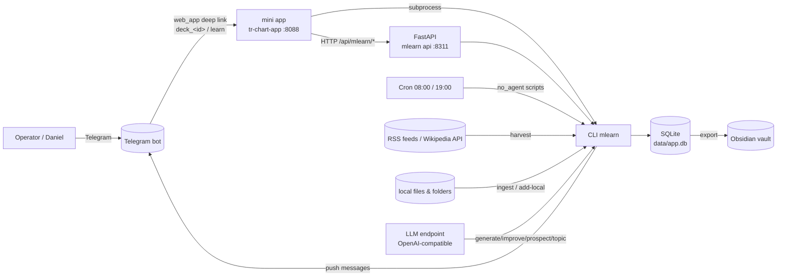
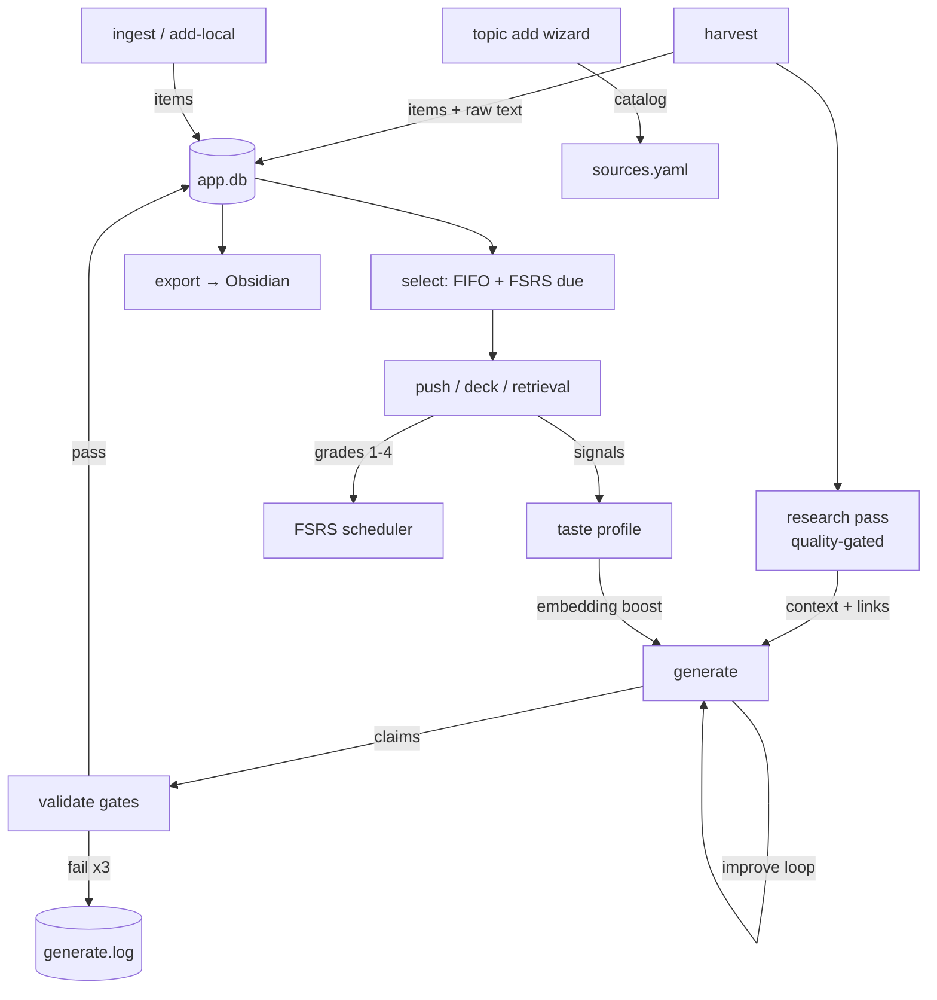
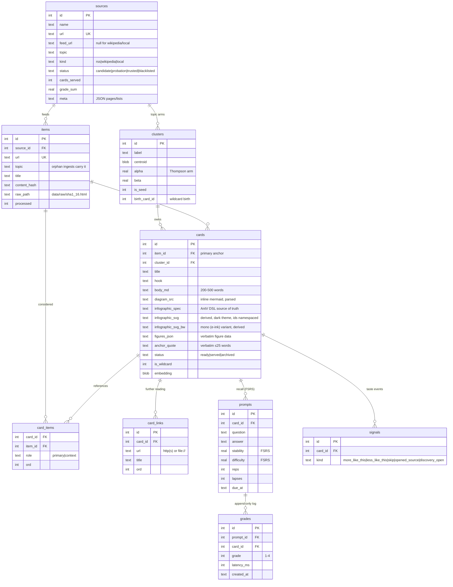

# Architecture

Technical deep-dive for operators, contributors, and fork maintainers.
Companion pieces: [README](../README.md) (usage), [infographic guidelines](infographic-guidelines.md),
[RFC 2026-09](rfc-2026-09-multi-source-research.md) (multi-source cards + research pass).

## 1. System context

- **Headless core** (the `mlearn` package): one persistence layer (SQLite), zero
  network dependencies at the library level except where a module says so.
- **CLI** is the only write path into the DB; the REST API is read-heavy
  (`decide` is the single write it forwards, for deck UIs).
- **Telegram push** is a `no_agent` cron script on the Mac Mini, not an agent
  task: `mlearn_push.py` (prospect → `next --no-serve` → teaser + inline
  `web_app` button) and `mlearn_retention.py` (`due --count 3`).

## 2. Runtime perspective (processes & data flow)

Pipeline semantics: discovery and generation are decoupled — `items` are a
buffer; `cards` are the output. `prospect` (LLM) and `research` (corpus +
Wikipedia) quality-gate _before_ generation; `validate` gates _after_.

## 3. Static perspective (modules)

| Module | Responsibility |
|---|---|
| `cli.py` | Typer CLI; every command supports `--json`; sole write path |
| `config.py` | config.yaml (machine) + sources.yaml (forkable allowlist/catalog) |
| `db.py` | SQLite schema v3, idempotent migrations, backfills |
| `harvest.py` | RSS (robots/ETag), Wikipedia API, local sources → items |
| `local.py` | scan/extract/ingest local files (md/txt, docx/rtf/html, optional PDF) |
| `topic.py` | catalog wizard: LLM proposes topic + guardrail + seed sources |
| `research.py` | detail heuristic; cross-source context (≤3) + title-verified links (≤3) |
| `prospect.py` | LLM discovery over unprocessed pop-science items |
| `embed.py` | fastembed bge-small (semantic search, dedupe, taste) |
| `generate.py` | the funnel: pick → research → generate_card → validate → insert |
| `validate.py` | gates C3/C4/C6/C8 + figure/verbatim/abbreviation checks |
| `visualqa.py` | banner QA: icon refs, label legibility, liveliness |
| `infographic.py` | AntV spec render/QA bridge to `tools/render_infographic.mjs` |
| `bw.py` | mono (e-ink) variant: derive, ID namespacing, saturation gate, backfill |
| `improve.py` | in-place polish (content/banner/all), full re-gate of changed fields |
| `select.py` | serving: FIFO ready pool, FSRS due prompts, `next --no-serve` peek |
| `taste.py` / `novelty.py` | embedding taste rank; wildcard topic birth |
| `project.py` | export live cards → Obsidian markdown, prune stale |
| `api.py` | FastAPI :8311 (read; `POST /decide` write) |
| `scout.py` | feed health heuristics |

## 4. Data perspective (ER)

Effective schema (v3 — `kind`, `items.topic`, `card_items`, `card_links`,
`cards.infographic_svg_bw` are additive migrations; `init_db` is idempotent):

State machines:

- **items**: `processed=0 → 1` (consumed by generation; a `processed=1` item
  is still research-eligible context).
- **cards**: `ready → served` (pushed/discovered/swiped) or `ready → archived`
  (re-roll). Archived cards keep history and stay in the dedupe shadow.
- **sources**: `candidate → probation → trusted | blacklisted` (promotion is
  `mlearn promote`; blacklist freezes harvesting, not serving history).

## 5. Dynamic perspective — the generation funnel

Every card passes, in order:

1. **Pick** — round-robin over clusters (Thompson), wildcard slot per run,
   unprocessed items ranked by taste boost (`taste_strength`).
2. **Dedupe** — embedding cosine vs. the active pool (threshold 0.92);
   near-duplicates are skipped, not archived.
3. **Research** — `needs_research()`: detailed primary material (≥1500 words
   AND ≥2 headings/8 blocks) skips; thin material pulls ≤3 same-topic
   cross-source items (all kinds, processed or not, embedding-ranked) and
   ≤3 title-verified Wikipedia links.
4. **Generate** — one LLM call (system: topic guardrail + content standard +
   JSON contract incl. `further_reading`; user: source text + context).
5. **Validate** — C3 anchor verbatim (≤25 words), C4 figure data with
   verbatim source spans, C6 family (one main infographic, no hero mermaid,
   inline mermaid parse, unexplained abbreviations), C8 further-reading
   format/count/dup, body 200-500 words, plus visual QA (icon refs
   resolved, labels visible, ≥2 hue families). 3 attempts, then reason-logged.
6. **Insert** — card + prompts + `card_items` (primary + context) +
   `card_links`; the same transaction updates the source counters.

## 6. Concurrency & consistency

- SQLite WAL mode, `busy_timeout=5000`, foreign keys on; one process writes
  at a time via an fcntl lock (`data/generate.lock`) held by generation.
- The hourly `tick` skips while a manual/regeneration run holds the lock.
- `grades` is append-only (SQL triggers) — latency_ms goes into the INSERT.
- `improve` runs WITHOUT the lock (no inserts → no dedupe race) and commits
  per card, so a crashed campaign keeps partial progress.
- `upsert_sources` defaults to `prune=True`: rows missing from sources.yaml
  are deleted (no history) or retired (history) — explicit
  `prune=False` for single-source writes like `add-local`.
- Raw bodies live on disk (`data/raw/<sha1[:16]>.html`); the DB keeps the
  hash + path. Item edits re-mine only when no live card anchors the item.

## 7. Deployment layout (Mac Mini)

| Path | Role |
|---|---|
| `~/dev/mlearn` | repo; venv `.venv`; `config.yaml` machine-specific, gitignored |
| `~/dev/mlearn/sources.yaml` | forkable allowlist: topics + rss/wikipedia/local sources |
| `~/dev/mlearn/data/app.db` | source of truth (WAL sidecars) |
| `~/dev/mlearn/data/raw/` | fetched bodies (sha1-named) |
| `~/dev/mlearn/data/logs/generate.log` | drop reasons, attempt trail |
| `~/dev/mlearn/data/prospect_state.json` | reviewed-item ids (never re-reviewed) |
| `~/dev/mlearn/tools/` | node renderers: `render_infographic.mjs`, `parse.mjs` |
| `~/dev/mlearn/examples/deck/` | standalone swipe-deck example |
| `~/dev/tr-chart-app` | mini-app backend :8088 (launchd `ai.tr-chart-app`) |
| `~/.hermes/scripts/` | `mlearn_push.py` (08:00, cap 1), `mlearn_retention.py` (19:00, cap 3) |
| `~/dev/private-notes/Learning/mlearn/cards/` | Obsidian projection |

Ports: REST API `127.0.0.1:8311` (optional; `API_SERVER_KEY`); mini-app
backend `:8088`, reachable over LAN or a private VPN (Tailscale) via the
app's HTTPS host.

## 8. Quality gates (summary)

- **Content**: 200-500 words, pyramid principle, easy language (≤20-word
  sentences, jargon defined inline, abbreviations parenthesized at first use).
- **Art**: one main image = AntV infographic (spec is the source of truth;
  SVG derived, forced dark theme, bright palettes); mermaid only inline
  (zero-to-many); every label/icon must survive rendering (truncation
  detector, dangling-ref rejection).
- **Science**: anchor verbatim in source text; quantitative diagrams carry
  figures_json with verbatim spans; research links title-verified.
- **Retention**: each card ≥2 recall prompts; FSRS scheduling; evening push
  caps at 3 due prompts.